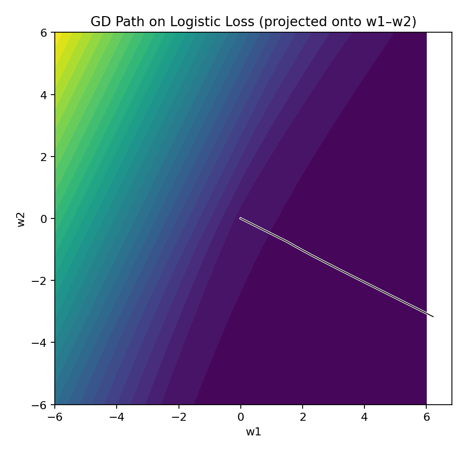

# ML Foundations — Day 4: Gradient Descent
Implement gradient descent from scratch in NumPy and visualize loss surfaces (2D/3D), learning-rate effects, convergence, and optimization intuition.

## Status
Project complete – Documentation in progress

## Roadmap

## Results
Here are key visualizations generated by the Day 4 demos:

- Vanilla GD on convex/quadratic
- Logistic regression GD
- 2D/3D loss surface plots
- Learning-rate sweep + divergence
- Batch vs stochastic vs mini-batch (preview)

## Setup
python -m venv .venv && source .venv/bin/activate
pip install numpy matplotlib jupyter
### Quadratic Loss (Contour + GD Path)

### Loss vs Iteration

### Learning Rate Sweep
Example of different learning rates:

### 3D Surface of Quadratic Bowl

### Logistic Regression Loss Surface

### GD Path on Logistic Loss

