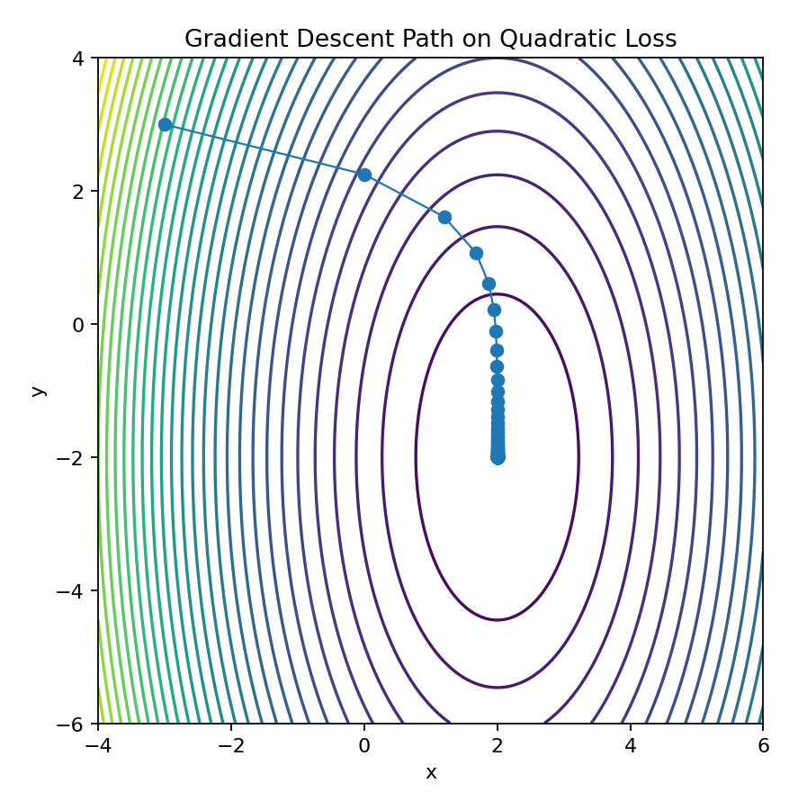
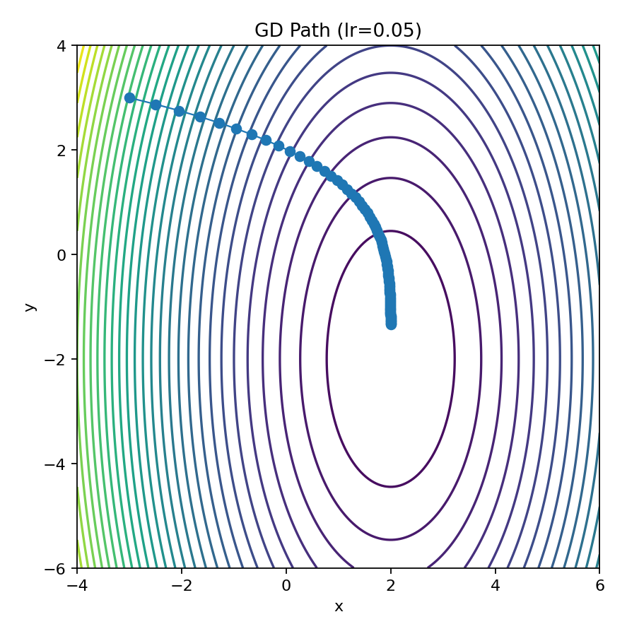
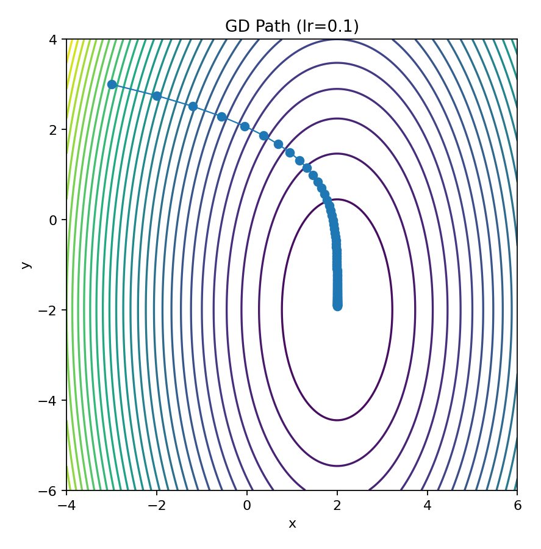
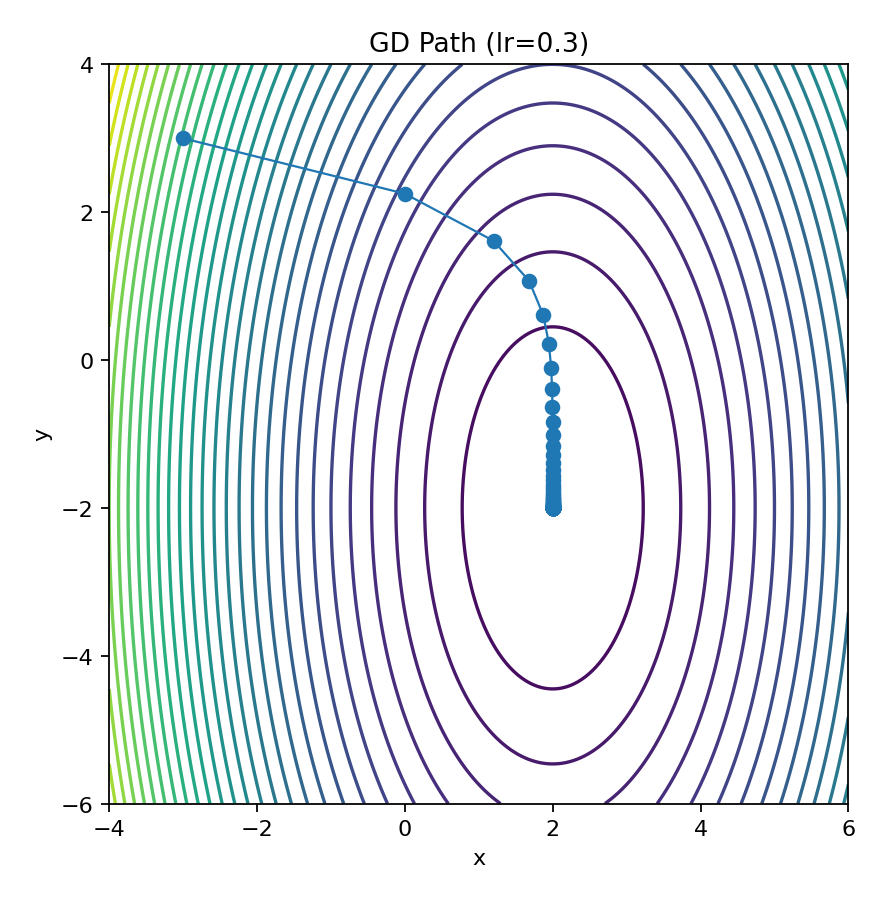
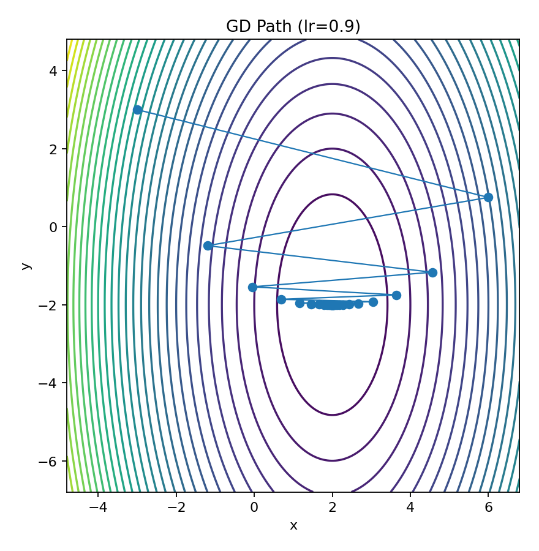
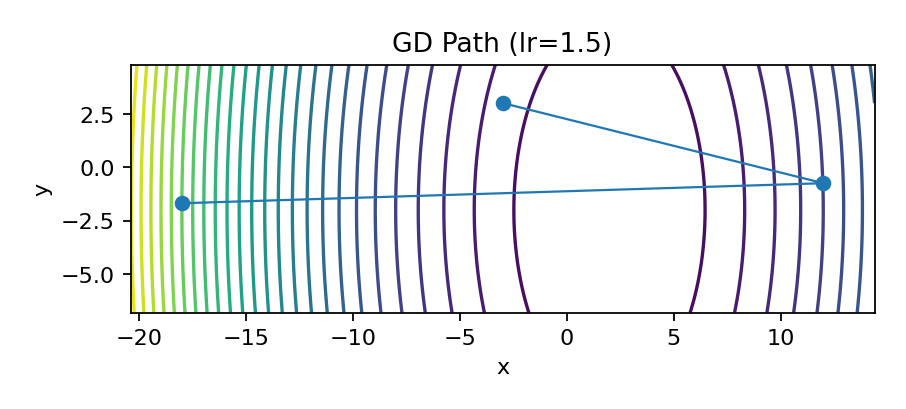

# ML Foundations — Day 4: Gradient Descent

Implement gradient descent from scratch in NumPy and visualize loss surfaces (2D/3D), learning-rate effects, convergence, and optimization intuition.

## Status
Project complete – Documentation in progress

## Roadmap
- Vanilla GD on convex/quadratic
- Logistic regression GD
- 2D/3D loss surface plots
- Learning-rate sweep + divergence
- Batch vs stochastic vs mini-batch (preview)

## Setup
~~~bash
python3 -m venv .venv
source .venv/bin/activate
pip install -r requirements.txt
~~~

## Run demos (headless)
~~~bash
export MPLBACKEND=Agg
PYTHONPATH=src python examples/quadratic_contours.py
PYTHONPATH=src python examples/lr_sweep.py
PYTHONPATH=src python examples/surface3d.py
PYTHONPATH=src python examples/logreg_surface.py
~~~

## Results

### Quadratic Loss (Contour + GD Path)

### Loss vs Iteration

### Learning Rate Sweep

### 3D Surface of Quadratic Bowl

### Logistic Regression Loss Surface

### GD Path on Logistic Loss

